# Использование Visual Studio Code и git для оформления ДЗ

Disclaimer: инструкция для Windows. Все тесты проводились на Windows 11, но должны работать и на Windows 10. В целом, шаги одинаковы для любой ОС, могут отличаться детали.


Visual Studio Code выбран как очень популярный и удобный не только текстовый редактор, но и среда разработки. Программа поддерживает ssh/sftp/ftp клиенты, docker, WSL и множество других плагинов. 
Можете использовать любые другие инструменты, например, для модификации MD Typora и git клиент для работы с git репозиториями, например, github desktop.


## Подготовка ПО и репозитория

1. Установите Visual Studio Code https://code.visualstudio.com/Download
1. Установить плагин `Markdown Preview Github Styling` для чего:
    1. Запустить VS Code
    1. Открыть меню Extensions (`CTRL+SHIFT+X`)
    1. Ввести в строку поиска `Markdown Preview Github Styling`
    1. Выбрать найденный плагин и нажать `Install`  
    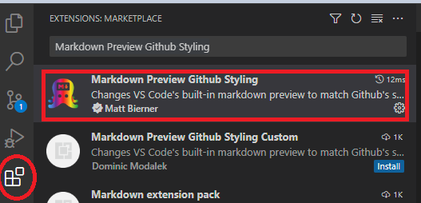
1. Зарегистрироваться на какой-либо площадке для размещения репозиториев git, например, [github.com](https://github.com/), но можете использовать и другие
1. Установить Git for Windows https://git-scm.com/download/win. При установке можно оставить все значения по умолчанию.
    1. После установки в любой папке в проводнике `клик правой кнопкой мыши` -  `Git Bash here`
    1. В открывшемся окне настроить глобальные `имя пользователя` (произвольное) и `email` (email должен совпадать с тем, которое использовалось при регистрации на github.com)
    ```bash
        git config --global user.name "имя пользователя"
        git config --global user.emal "email"
    ```
    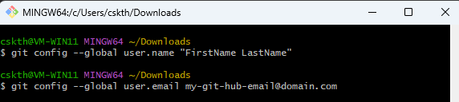
1. Создать новый репозиторий на github.com (здесь и далее примеры для github.com; могут  быть отличия, если вы выбрали другой хостинг):
    1. Зайти на свою страницу github.com
    1. Зайти в Repositories (кнопка сверху) 
    1. Нажать зеленую кнопку `New`
    1. Выбрать имя репозитория (в этом примере выбрано `otus_network_engineer`)
    1. Сделать его публичным (`Public`)
    1. Выбрать `Add a README file` (опционально). В репозитории автоматически будет создан тестовый `README.md` файл. Можете создать его позже вручную
    1. Нажать `Create`
    1. Скопировать ссылку для клонирования репозитория: зеленая кнопка `Code` – нажать на кнопку, показанную на скриншоте ниже  
    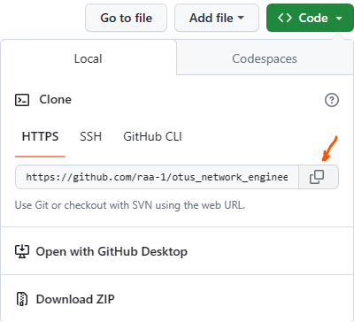
1. В VS Code нажать кнопку `Source Control` (или `CTRL+SHIFT+G`) – выбрать `Clone repository`  
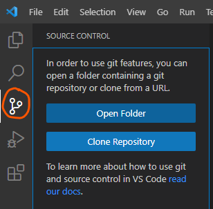
1. Вставить URL, который был скопирован на шаге 5.6.
1. Выбрать папку, куда будет скопирован репозиторий с github.com, например, `C:\OTUS`. Согласиться доверять авторам (если спросит). Согласиться открыть папку после создания.
1. (Если не открыли на предыдущем шаге или нужно открыть произвольную папку в редакторе) `File` – `Open folder`, или `CTRL+K CTRL+O` (это значит держать `CTRL` и нажать сначала `K`, затем `O`) — выбрать `C:\OTUS\имя репозитория` (можно и просто `C:\OTUS`) -  Согласиться доверять авторам (если будет вопрос).
>Горячие клавиши перечислены в меню `Шестеренка в нижнем левом углу` - `Keyboard Shortcuts` (или `CTRL+K CTRL+S`)


## Первый коммит
1. Создайте файл `README.md`, если он еще не создан, и откройте его (один клик левой клавишей мыши)
1. Содержимое файла откроется в отдельной вкладке  
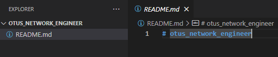
1. Введите заголовок, описывающий весь репозиторий, например,       `# Репозиторий лабораторных работ курса "Сетевой инженер" в OTUS.ru`. <br>
> **Обратите внимание**  
> Если в файле есть несохраненные измнения, VS Code обозначит это значком 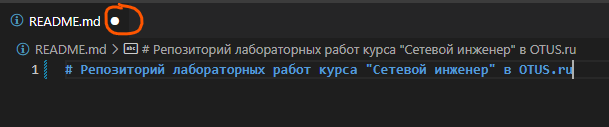
4. Откройте окно `preview` для проверки того, как ваш md будет отображаться  
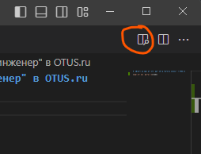  

    Вы будете видеть в реальном времени, как разметка Markdown интерпретируется. [Справка по синтаксису Markdown на русском](https://github.com/sandino/Markdown-Cheatsheet)
4. Сохраните изменение в файле `CTRL+S`
4. VS code поймет, что в репозитории есть изменения, которые отсутствуют в git:
* имя файла в списке файлов и в имени вкладки поменяет цвет
* появится цифра с количеством измененных файлов около значка `Source control`  
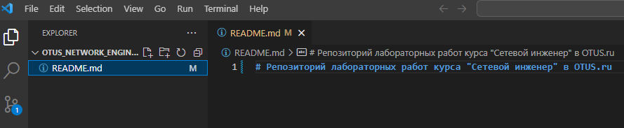
4. Когда все изменения внесены, нажмите значок `Source control` или `CTRL+SHIFT+G`
4. Будут показаны файлы, изменения в которых произошли с момента последнего коммита
4. **Введите название вашего коммита** (это важно, без него коммит не будет принят git’ом), например, `Первый коммит` на скриншоте ниже.
4. Нажмите  
    * или `Commit`, тогда изменения будут внесены в репозиторий только локально на вашем компьютере и не уйдут в удаленное хранилище, так можно делать, если у вас несколько коммитов, которые вы хотите сделать, а затем синхронизировать изменения все за раз. VS Code спросит, хотите ли вы сделать Push изменений в удаленное хранилище
    * или в выпадающем списке выберите `Commit & Push`, это внесет изменения в локальный репозиторий и синхронизирует его с сервером  
    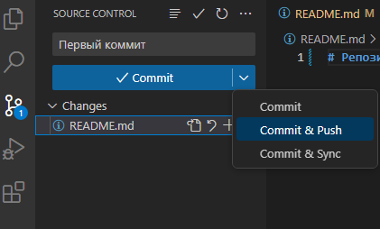
4. Согласиться отправлять изменения в staging
4. Откроется окно аутентификации вас на github.com (это будет сделано только в первый раз, далее изменения будут уходить автоматически)
    * Выберете аутентфикацию через браузер и разрешите доступ
4. Ваш первый коммит синхронизирован с сервером. Откройте репозиторий в браузере (обновите страницу), изменения в `README.md` должны быть видны
4. В последующем выполняйте шаги 4-7 для отправки изменений в локальный репозиторий git и его синхронизации с удаленным сервером 

## Использование примеров оформления лабораторных работ как шаблонов

Оформление лаборных — это подготовка тектовых файлов. Может быть множество способов как забрать и использовать тестовые файлы, подготовленные другими студентами, как шаблоны. Ниже представлен лишь один из них.
       
Идеал, как известно, недостижим, но это не значит, что к нему не нужно стремиться :) Можете менять формат так, как вы считаете нужным, строгих требований к оформлению нет. Задача всей активности — научиться вести документацию и работать с git и md.

Желательно:
* Для каждой работы создавайте отдельную папку 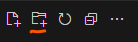. Создавайте файл `README.md` внутри каждой папки, в котором описывайте работу. **Внимание**: git не добавляет в репозиторий пустую папку
* Используйте скриншоты по минимуму, в идеале только для диаграмм. Все выводы команд лучше оформлять как блоки кода ``` 
* Сохраняйте конфигурации устройств и самой лабы (если применимо, например, zip архив конфигурации лабы в eve-ng) для каждой работы

-------------
1. В качестве примера оформления работ можем рекомендовать использовать [mbfx/otus-networks: OTUS - Сетевой инженер - Проектные и практические работы](https://github.com/mbfx/otus-networks) . Вы можете клонировать этот репозиторий и копировать файлы из него в свой репозиторий, исправлять их, коммитить и пушить на github.com
1. Откройте репозиторий в браузере и скопируйте ссылку для его клонирования (аналогично тому, как вы делали со своим репозиторием) — `зеленая кнопка Code` – копировать ссылку для HTTPS.
1. В VScode нажмите значок `Source control` или `CTRL+SHIFT+G`
1. Нажмите `три точки` – `Clone`  
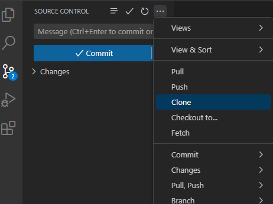
1. Вставьте скопированную ссылку
1. Выберете папку, куда будут клонирован репозиторий, например, `C:\OTUS` (только **не** в папку со своим репозиторием)
1. VS code спросит открыть ли папку в этом или новом окне. Выбирайте как удобно лично вам
1. Файлы скопированы. Теперь вы можете копировать их в свой репозиторий, исправлять под себя и `Commit&Push` изменения.
